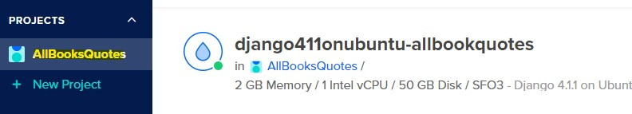
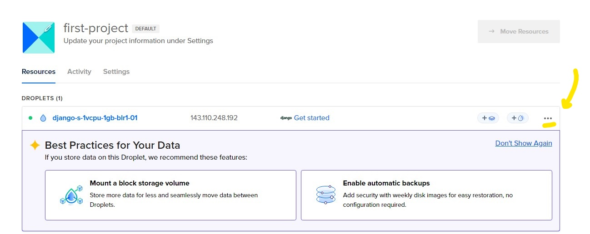
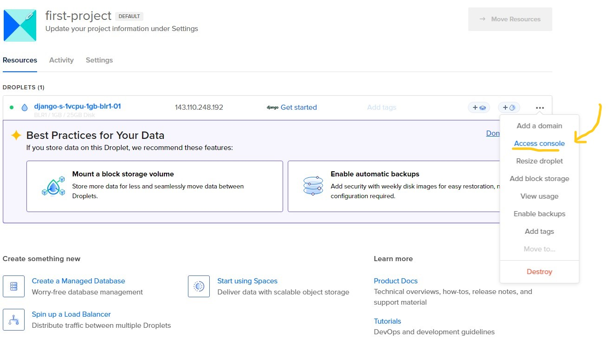
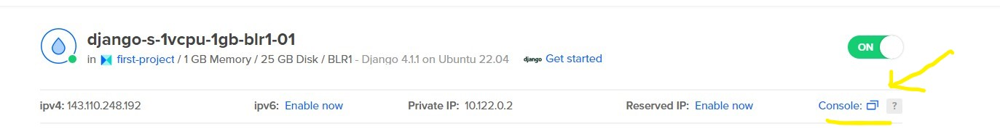

# **ALLBOOKSQUOTES DJANGO APP**
AllBooksQuotes is a Web application made with Django which works with Amazon Affiliate Program and Google Adsense. It is a community for enthusiast Book Readers to read over 50,000 quotes from over 11,000 books from different categories.

### Console Login:
STEP 1:

STEP 2:

STEP 3:

STEP 4:

### **Working Directory:**

_/home/django/All-Book-Quotes_

(Use **ls** command to go to the working directory)

**Note: (pwd** will print the full path to the working directory)

### **DJANGO COMMANDS:**

#### 1. **Create Admin User:**

    python3 manage.py createsuperuser

#### 2. **Collect Static files after making any changes in img, css or javascript files of static folder:**

    python3 manage.py collectstatic
    
#### 3. **Download random images from Unsplash**

	python3 manage.py download_random_images 50 # replace 50 with the number of images you want

#### 4. **Generate quotes Images with Text**

	# 1. pass argument all for all images in the database
	python3 manage.py generate_quote_images all 
	
	# 2. pass books slug separated by a space 
	python3 manage.py generate_quote_images twilight the-thunder-games 

#### 5. **Populate books from json file in database**

	python3 manage.py populate_db_from_json books.json 
	# Note: books.json is the path to the json file

#### 6. **Extract Images from bookquoters.com**

	python3 manage.py extract_images books.json
	# Note: books.json is the path to the json file

#### 7. **Populate Amazon Affiliate Link in database**

	python3 manage.py amazon_affiliate_link all

	python3 manage.py amazon_affiliate_link [book_slug] [book_slug2]
	Note: [book_slug] is the part of url without "-quotes"

#### **Read the logs of gunicorn server:**

    tail /var/log/gunicorn/dev.log

#### **Edit files:**

	nano <filepath>

(Press ctrl+x => y => Enter to save the file)

###  **Restart Nginx server**

	 systemctl restart nginx

	 systemctl reload nginx	

(Use both commands)
###  **Restart Gunicorn server**
	jobs -l # Locate process id
	kill 1234 # pass process id here
	gunicorn -c config/gunicorn/dev.py # start the server
### 
	

